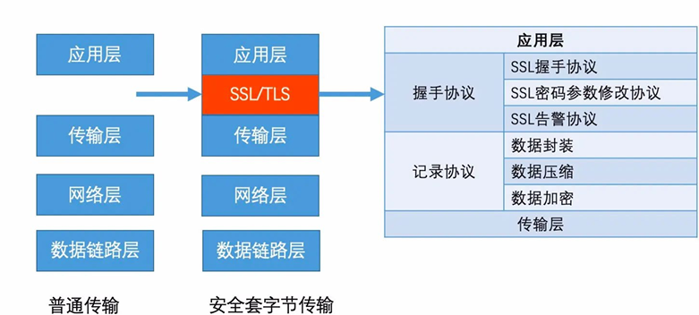
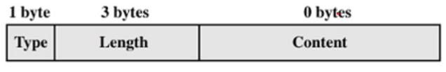
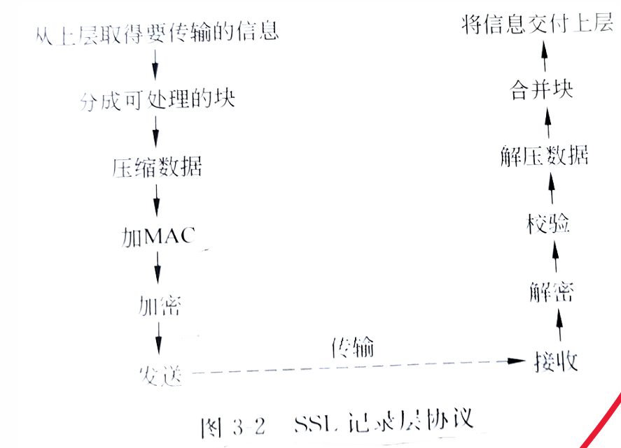

# 第一章 网络安全概述

## 1.1 网络安全的概念

**国际标准化组织（ISO）对计算机系统安全的定义是：**

为数据处理系统建议和采用的技术和管理的安全保护，保护计算机硬件、软件和数据不因偶然和恶意的原因遭到破坏、更改和泄露。

由此，可以将**计算机网络的安全理解为：**

通过采用各种技术和管理措施，使网络系统正常运行，从而确保网络数据的可用性、完整性和保密性。

---

**网络安全主要包括：**

- 网络实体安全	
- 软件安全
- 数据安全
- 安全管理

---

**网络安全的特征：**

- 保密性
- 完整性
- 可用性
- 可控性
- 可审查性
- 可靠性

---

## 1.2 网络面临的安全威胁

**安全威胁的表现形式主要有以下几个方面：**

- 身份窃取
- 非授权访问
- 冒充合法用户
- 数据窃取
- 破坏数据的完整性
- 拒绝服务
- 否认
- 数据流分析
- 旁路控制
- 干扰系统正常运行
- 病毒与恶意攻击
- 电磁泄漏
- 人员疏忽

---

**<font style="color:red">上述安全威胁的表现形式可以归纳为两大类：</font>**

- **实体安全威胁：**指对**计算机设备、网络设备、通信设施、通信线路**及**网络环境**等物理实体构成的安全威胁
- **信息安全威胁：**指信息在**加工处理、传输和存储过程**中受到的安全威胁。对于在网络信息**传输过程中**受到的安全威胁主要有四种，**分别是截获、中断、篡改和伪造**

---

## 1.3 网络安全体系结构

**网络安全模型是**动态网络安全过程的抽象描述

---

**OSI是开放系统互连**

---

所谓**安全体系结构**，指的是**一个计划**和**一套原则**

---

**ISO/OSI安全体系结构包括了3部分内容：**

- 安全服务
- 安全机制：加密机制、数字签名机制、访问控制机制、数据完整性机制、鉴别交换机制、业务填充机制、路由控制机制和公证机制
- 安全管理                                                                                                                                                                                                                                                                                                                                                                                                                                                                                                                                                                                                                                                                                                                                                                                                                                                                                                                                                                       

---

**PDR模型**

- 防护（Protection）
- 检测（Detection）
- 响应（Response）

**PDRR模型**

- 防护（Protection）
- 检测（Detection）
- 响应（Response）
- 恢复（Recovery）

---

## 1.4 网络安全管理

**中国网络安全评价标准**

<table border="1" cellspacing="0" cellpadding="5" style="text-align: center; border-collapse: collapse;">
    <thead>
        <tr>
            <th>等级</th>
            <th>对象</th>
            <th>侵害客体</th>
            <th>侵害程度</th>
            <th>监管强度</th>
        </tr>
    </thead>
    <tbody>
        <tr>
            <td>第一级</td>
            <td rowspan="3">一般系统</td>
            <td>合法权益</td>
            <td>损害</td>
            <td>自主保护</td>
        </tr>
        <tr>
            <td rowspan="2">第二级</td>
            <td>合法权益</td>
            <td>严重损害</td>
            <td rowspan="2">指导</td>
        </tr>
        <tr>
            <td>社会秩序和公共利益</td>
            <td>损害</td>
        </tr>
        <tr>
            <td rowspan="2">第三级</td>
            <td rowspan="4">重要系统</td>
            <td>社会秩序和公共利益</td>
            <td>严重损害</td>
            <td rowspan="2">监督检查</td>
        </tr>
        <tr>
            <td>国家安全</td>
            <td>损害</td>
        </tr>
        <tr>
            <td rowspan="2">第四级</td>
            <td>社会秩序和公共利益</td>
            <td>特别严重损害</td>
            <td rowspan="2">强制监督检查</td>
        </tr>
        <tr>
            <td>国家安全</td>
            <td>严重损害</td>
        </tr>
        <tr>
            <td>第五级</td>
            <td>极端重要系统</td>
            <td>国家安全</td>
            <td>特别严重损害</td>
            <td>专门监督检查</td>
        </tr>
    </tbody>
</table>
**美国网络安全评价标准**

TCSEC（网络安全橙皮书）把计算机安全分为A、B、C、D4个等次7个级别

<table border="1" cellspacing="0" cellpadding="5" style="border-collapse: collapse; text-align: center; width: 100%;">
    <thead>
        <tr>
            <th>等次</th>
            <th>级别</th>
            <th>名称</th>
            <th>主要特征</th>
        </tr>
    </thead>
    <tbody>
        <tr>
            <td>D</td>
            <td>D</td>
            <td>低级保护</td>
            <td>没有安全保护</td>
        </tr>
        <tr>
            <td rowspan="2">C</td>
            <td>C1</td>
            <td>自主安全保护</td>
            <td>自主存储控制</td>
        </tr>
        <tr>
            <td>C2</td>
            <td>受控存储控制</td>
            <td>单独的可查性，安全标识</td>
        </tr>
        <tr>
            <td rowspan="3">B</td>
            <td>B1</td>
            <td>标识的安全保护</td>
            <td>强制存取控制，安全标识</td>
        </tr>
        <tr>
            <td>B2</td>
            <td>结构化保护</td>
            <td>面向安全的体系结构，较好的抗渗透能力</td>
        </tr>
        <tr>
            <td>B3</td>
            <td>安全区域</td>
            <td>存取监控、高抗渗透能力</td>
        </tr>
        <tr>
            <td>A</td>
            <td>A</td>
            <td>验证设计</td>
            <td>形式化的最高级描述和验证</td>
        </tr>
    </tbody>
</table>

---

## 1.5 知识点补充

**“安全”并没有统一的定义，但基本可以解释为：**客观上不存在威胁，主观上不存在恐惧

**“信息安全”没有公认和统一的定义，但国内外对信息安全的论述大致可以分为两大类（广义上）：**

- 具体的信息系统的安全
- 某一特定信息体系（比如一个国家的金融系统、军事指挥系统等）的安全

---

**网络安全从本质上讲**

就是网络上信息的安全，即网络上信息保存、 传输的安全，指网络系统的硬件、软件及其系统中的数据受到保护， 不受偶然和或者恶意的原因而遭到破坏、更改、泄露，系统连续可靠正常地运行，网络服务不中断。

---

## 1.7 常用的网络安全管理技术

**防火墙、入侵检测、入侵防御、网络安全态势感知、VPN等安全技术。**

---

**访问控制**

在互联网这个开放环境中，如何将受保护资源按照要求授权给指定用户访问，实现资源访问的可控性和可管理性，这就需要访问控制技术。

访问控制是通过某种途径允许或限制主体对客体访问能力及范 围的一种方法。

- 传统的访问控制

	- 自主访问控制（Discretionary Access Control，DAC）
	- 强制访问控制（MandatoryAccess Control，MAC）

- **基于角色的访问控制**

	RBAC Role-Based Access Control，基于角色的访问控制。RBAC的核心思想就是将访问权限与角色相联系，通过给用户分配合适的角色，让用户与访问权限相联系。

	RBAC的特点：

	- 访问权限与角色相关联，不同的角色拥有不同的权限。
	- 角色继承。角色之间可能有互相重叠的职责和权力，属于不同角色的用户可能需要执行一些相同的操作。
	- 最小权限原则，即指用户所拥有的权限不能超过他执行具体工作时所需的权限。

---

## 1.8 计算机网络体系结构复习

<table border="1" cellspacing="0" cellpadding="5" style="border-collapse: collapse; text-align: center; width: 100%;">
    <thead>
        <tr style="background-color: #f0f0f0;">
            <th>OSI 体系结构</th>
            <th>TCP/IP 体系结构</th>
            <th>五层协议体系结构</th>
        </tr>
    </thead>
    <tbody>
        <tr>
            <td>7 应用层</td>
            <td rowspan="3">应用层<br><span style="font-size: 0.9em;">(各种应用层协议如<br>TELNET, FTP, SMTP 等)</span></td>
            <td rowspan="3">5 应用层</td>
        </tr>
        <tr>
            <td>6 表示层</td>
        </tr>
        <tr>
            <td>5 会话层</td>
        </tr>
        <tr>
            <td>4 运输层</td>
            <td>运输层 (TCP 或 UDP)</td>
            <td>4 运输层</td>
        </tr>
        <tr>
            <td>3 网络层</td>
            <td>网际层 IP</td>
            <td>3 网络层</td>
        </tr>
        <tr>
            <td>2 数据链路层</td>
            <td rowspan="2">网络接口层</td>
            <td>2 数据链路层</td>
        </tr>
        <tr>
            <td>1 物理层</td>
            <td>1 物理层</td>
        </tr>
    </tbody>
</table>

---

**应用层**

网络服务与最终用户的一个接口。接收用户的数据，人机交互的接口，面向的应用程序 

协议有：**HTTP FTP TFTP SMTP SNMP DNS TELNET HTTPS POP3 DHCP** 

**表示层**

数据的表示、安全、压缩。

格式有：**JPEG、ASCll、EBCDIC、加密格式等**

**会话层**

建立、管理、终止会话。

**传输层**

定义传输数据的协议端口号，以及流控和差错校验。

协议有：**TCP UDP**，数据包一旦离开网卡即进入网络传输层

**网络层**

network编址寻址。使用IP地址实现主机之间的逻辑寻址。进行逻辑地址寻址，实现不同网络之间的路径选择。

协议有：**ICMP IGMP IP（IPV4 IPV6）**

**数据链路层**

建立逻辑连接、进行硬件地址寻址、差错校验等功能。

数据链路层分为**LLC层（逻辑链路控制子层）**和**MAC层（介质访问控制子层）**

**物理层**

建立、维护、断开物理连接。

传输介质（有线、无线） 

- 有线：同轴电缆、双绞线、光纤 
- 无线：红外线、微波、蓝牙、无线电

# 网络安全协议

## SSL协议

SSL是Netscape开发的专门用户保护Web通讯的，目前版本为3.0。最新版本的**TLS 1.0**是IETF（工程任务组）制定的一种新的协议，它建立在SSL 3.0协议规范之上，是SSL 3.0的后续版本。 两者差别极小，可以理解为**SSL 3.1**。

---

 **SSL（Secure Socket Layer，安全套接字层）**

位于**传输层和应用层之间**的一种协议层。应用层数据不再直接传递给传输层，而是传递给SSL层， SSL层对从应用层收到的数据进行加密，并增加自己的SSL头。



---

**<font style="color:red">SSL提供的服务有：</font>**

- **身份合法性：**认证用户和服务器，确保数据发送到正确的客机和服务器；
- **数据机密性：**加密数据以防止数据中途被窃取；
- **数据完整性：**维护数据的完整性，确保数据在传输过程中不被改变。采用信息鉴别码（MAC）来验证数据的完整性，MAC是采用Hash函数实现的。

---

**握手协议**

允许服务器和客户机相互验证，协商加密和MAC算法以及保密密钥，用来保护在SSL记录中发送的数据。握手协议是在应用程序的数据传输之前使用的 。

每个握手协议包含以下3个字段：

- Type：表示10种消息类型之一
- Length：表示消息长度字节数
- Content：与消息相关的参数



---

**<font style="color:red">握手协议包括四个阶段</font>**


---

**<font style="color:red">SSL记录协议(SSL Record Protocol)</font>**

记录协议在客户机和服务器握手成功后使用，即客户机和服务器鉴别对方和确定安全信息交换使用的算法后，进入SSL记录协议，记录协议向SSL连接提供两个服务：

- **保密性：**使用握手协议定义的秘密密钥实现
- **完整性：**握手协议定义了消息鉴别码MAC， 用于保证消息完整性



---

**<font style="color:red">HTTPS比HTTP慢</font>**

通常，HTTP直接和TCP通信。当使用SSL时，则演变成先和SSL通信，再由SSL和TCP通信了。 简言之，所谓HTTPS，其实就是身披SSL协议这层外壳的HTTP。

SSL的慢分两种。一种是指通信慢。另一种是指由于大量消耗CPU及内存等资源，导致处理速度变慢。

- 和使用HTTP相比，网络通信可能会变慢2到100倍。除去和TCP连接、发送HTTP请求响应以外， 还必须进行SSL通信，因此整体上处理通信量不可避免会增加。
- 另一点是SSL必须进行加密处理。在服务器和客户端都需要进行加密和解密的运算处理。因此从结果上讲，比起HTTP会更多地消耗服务器和客户端 的硬件资源，导致负载增强。

针对速度变慢这一问题，并没有根本性的解决方案，只有使用SSL加速器这种（专用服务器）硬件来改善该问题。该硬件为SSL通信专用硬件，相对软件来讲，能够提高数倍SSL的计算速度。仅在SSL处理时发挥SSL加速器的功效，以分担负载。

---

## SET协议

**<font style="color:red">SET协议概述</font>**

SET主要是为了解决**用户、商家和银行**之间通过信用卡支付的交易而设计的，以保证支付信息的机密、支付过程的完整、商户及持卡人的合法身份、以及可操作性。

**SET协议的主要的目标如下：**

- 信息在因特网上的**安全传输**，保证网上传输的数据不被黑客窃听。
- **定单信息和个人账号信息的隔离。**在将包括持卡人账号信息的定单送到商家时，商家只能看到定货信息，而看不到持卡人的账户信息。
- 持卡人和商家相互认证，以确定通信双方的身份。 一般由**第三方机构**负责为在线通信双方提供信用担保。
- 要求软件**遵循相同的协议和消息格式**，使不同厂家开发的软件具有兼容和互操作功能，并且可以运行在不同的硬件和操作系统平台上。

---

**<font style="color:red">将数字摘要和数字签名结合</font>**


---

**<font style="color:red">数字信封技术</font>**


---

**双重签名**

双重签名的目的在连结两个不同接收者消息。在这里， 消费者想要发送**订单信息OI**到特约商店，且发送**支付命令PI**给银行。特约商店并不需要知道消费者的信用卡卡号，而银行不需要知道消费者订单的详细信息。 消费者需要将这两个消息分隔开，而受到额外的隐私保护。

在必要的时候这两个消息必须要连结在一起，才可以解决可能的争议、质疑。这样消费者可以证明这个支付行为是根据他的订单来执行的，而不是其它的货品或服务。


---

**SET协议的局限**

SET协议目前**只局限于银行卡的网上支付**，对其他方式的支付没有给出很好的解决方案。

---

**<font style="color:red">SSL与SET协议的比较</font>**

| **项目**             | **SSL 协议**       | **SET 协议**     |
| -------------------- | ------------------ | ---------------- |
| **工作层次**         | 传输层与应用层之间 | 应用层           |
| **是否透明**         | 透明               | 不透明           |
| **过程**             | 简单               | 复杂             |
| **效率**             | 高                 | 低               |
| **安全性**           | 商家掌握消费者     | 消费者对商家保密 |
| **认证机制**         | 双方认证           | 多方认证         |
| **是否专为 EC 设计** | 否                 | 是               |

---

## IPSec协议

IPSec不是一个单独的协议，是一组协议。包含 **AH（Authentication Header）协议**、**ESP（Encapsulating Security Payload）协议**和 **IKE （Internet Key Exchange）协议**。

- 其中AH协议定义了认证的应用方法 ，提供数据源认证和完整性保证；

- ESP协议定义了加密和可选认证的应用方法，提供可靠性保证；
- IKE用于密钥交换。

---

**<font style="color:red">AH协议结构</font>**

AH协议为IP通信提供数据源认证、数据完整性和反重播保证，它能保护通信免受篡改， 但不能防止窃听， 适合用于传输非机密数据。

AH的工作原理是在每一个数据包上添加一个身份验证报头。此报头包含一个带密钥的Hash散列（可以将其当作数字签名，只是它不使用证书），此Hash散列在整个数据包中计算，因此对数据的任何更改将致使散列无效——这样就提供了完整性保护。

AH可以采用**传输模式**和**隧道模式**对IP数据进行保护。**当采用传输模式时**， AH报头位置在IP报头和传输层协议报头之间。AH由IP协议号" 51"标识，该值包含在AH报头之前的协议报头中，如IP报头。AH可以单独使用，也可以与ESP协议结合使用。


---

**ESP协议结构**

ESP为IP数据包提供完整性检查、认证和加密，可以看作是"超级AH"，因为它提供机密性并可防止篡改。ESP服务依据建立的安全关联（SA）是可选的。然而，也有 一些限制：

- 完整性检查和认证一起进行；
- 仅当与完整性检查和认证一起时，"重播 （Replay）"保护才是可选的；
- "重播"保护只能由接收方选择。

并且

- ESP的加密服务是可选的，但如果启用加密，则也就同时选择了完整性检查和认证，因为如果仅使用加密，入侵者就可能伪造包以发动密码分析攻击。
- ESP可以单独使用，也可以和AH结合使用。一般ESP不对整个数据包加密，而是只加密IP包的有效载荷部分，不包括IP头。但在端对端的隧道通信中，ESP需要对整个数据包加密。
- **ESP报头插在IP报头之后，TCP或UDP等传输层协议报头之前。ESP由IP协议号"50"标识。**

---

**IPv4网络传输模式下ESP**

ESP 报头的位置在IP报头之后，TCP 、UDP 、或者ICMP等传输层协议报头之前 。如果已经有其他IPSec协议使用，则ESP报头应插在其他任何IPSec协议报头之前。


ESP认证报尾的完整性检查部分包括ESP报头、传输层协议报头，应用数据和ESP报尾，但不包括IP报头，因此ESP**不能保证IP报头不被篡改 。**

ESP加密部分包括上层传输协议信息、数据和ESP报尾。

---

**IPSec VPN的应用场景**

- Site-to-Site（ 站点到站点或者网关到网关 ）
- End-to-End（ 端到端或者PC到PC）
- End-to-Site（ 端到站点或者PC到网关）

---

# 第四章 网络设备常见安全技术

## VPN的基本类型及应用

根据应用环境的不同，VPN主要分为三种典型的应用方式：内联网VPN、外联网VPN和远程接入VPN。

- 内联网VPN


- 外联网VPN

	在内联网VPN中位于LAN1和LAN2中的主机是平等的，可以实现彼此之间的通信。 

	但在外联网VPN中，位于不同内部网络（LAN1、LAN2和LAN3） 的主机在功能上是不平等的。


- 远程接入VPN

	远程接入VPN也称为移动VPN，即为移动用户提供一种访问单位内部网络资源的方式。

	

---

**VPN涉及到的技术**

主要技术： VPN技术主要了包含隧道技术、加密技术、身份认证技术及访问控制技术、密钥管理技术。

---

**隧道技术**

被封装的数据包在公共互联网络上传递时所经过的逻辑路径称为隧道。

在进行数据封装时，根据在OSI参考模型中位置的不同，可以分为**第二层隧道技术**和**第三层隧道技术**两种类型。其中，**第二层隧道技术是在数据链路层使用隧道协议对数据进行封装**。

第二层隧道协议主要有：

- L2F（Layer 2 Forwarding，主要在RFC 2341文档中进行了定义）
- PPTP（Point-to-Point Tunneling Protocol，主要在RFC 2637文档中进行 了定义）
- L2TP（Layer 2 Tunneling Protocol，主要在RFC 2661文档中进行了定义）

第二层隧道协议是在OSI参考模型的第二层（数据链路层）实现的隧道协议。由于数据链路层的数据单位为帧，所以第二层隧道协议是以帧为数据交换单位来实现的。

**第三层隧道技术是在网络层进行数据封装。**

第三层隧道协议主要有：

- IPSec（IPSecurity，主要在RFC 2401文档中进行了定义）
- GRE（Generic Routing Encapsulation，主要在RFC 2784文档中进行了 定义）

第三层隧道协议对应于OSI参考模型中的第三层（网络层 ），使用分组 （也称为包）作为数据交换单位。

---

**加密技术**

实际应用时一般是将对称加密体制和非对称加密体制混合使用，利用非对称加密技术进行密钥的协商和交换，而采用对称加密技术进行用户数据的加密。

---

**<font style="color:red">VPN的应用优势</font>**

- 节约成本。
- 提供了安全保障。
- 易于扩展。

---

**<font style="color:red">VPN存在的不足</font>**

VPN存在的不足主要是安全问题。VPN扩展了网络的安全边界。例如，在局域网出口处设置了VPN网关后，网络的安全边界将由局域网扩展到了外部主机。如果外部主机的安全比较脆弱，那么入侵者可以利用外部主机连接到VPN网关后进入内部网络。

另外，VPN系统中密钥的产生、分配、使用和管理，以及用户身份的认证方式都会影响VPN系统的安全性 

在实际应用中，一种有效的安全解决方案是除建立完善的加密和身份认证机制外，还需要将VPN和防火墙配合应用，通过防火墙增加VPN系统的安全性。

---

**<font style="color:red">隧道协议内包括以下三种协议</font>**

- **乘客协议（Passenger Protocol）：** 是我们写的信；
- **封装协议（Encapsulating Protocol）：**是信封；
- **运载协议（Carrier Protocol）：**是信的运输方式，可以是陆运、 海运或空运。

---

**<font style="color:red">隧道的功能</font>**

- **将数据流量强制传输到特定的目的地。**虽然隧道建立在公共网络上，但是由于在隧道的两个端点（如VPN网关）之间建立了一条虚拟的通道，所以从隧道一端进入的数据只能被传输到隧道的另一端。
- **隐藏私有的网络地址。**
- **在IP网络上传输非IP协议的数据包。**
- **提供数据安全支持。**

---

**<font style="color:red">隧道的基本类型</font>**

- **主动式隧道：**如果客户端计算机是通过Internet拨号方式建立与隧道服务器的连接，需要以下三个步骤的操作：
	- 客户端计算机可以拨号连接到当地的ISP，建立一个到Internet的连接；
	- 在客户端计算机上利用隧道客户端软件与隧道服务器之间建立隧道；
	- 将客户端的PPP帧（用户数据）进行封装，通过隧道传送 到目的地。


- **被动式隧道：**
	- 在主动式隧道模式中，客户端计算机根据需要与隧道服务器之间建立临时的隧道。与主动式隧道不同的是，被动式隧道主要用于两个内部网络（LAN1与LAN2）之间的固定连接。
	- 与主动式隧道的另一个不同是，被动式隧道可以被多个客户端共享，而主动式隧道只能供建立该隧道的客户端计算机独立使用。
	- 在被动式隧道中，两个内部网络之间的隧道在用户传输数据之前就已经建立。


---

## 第二层隧道协议

### PPTP协议

**PPTP协议（主动式隧道）的工作过程**

- 建立TCP连接
- 建立PPTP控制层连接
- GRE隧道建立
- 压缩算法、加密算法、身份认证协商
- 发送数据、PPTP链路维护


---

**PPTP的报文格式**

在PPTP客户机与PPTP服务器之间传输的报文分为两种类型：

- 控制报文

	

- 数据报文


---

### L2TP协议

L2TP（Layer 2 Tunneling Protocol）是**第二层隧道协议**，其是典型的**被动式隧道协议**

L2TP主要由**LAC（L2TP Access Concentrator，L2TP接入集中器）**和**LNS（L2TP Network Server，L2TP网络服务器）**构成

---

**<font style="color:red">L2TP的特点</font>**

在安全性考虑上，**L2TP对传输中的数据（控制报文和数据报文）并不加密**，所以L2TP并不能满足用户对安全性的需求。为了消除L2TP协议的安全隐患，在实际应用中可以使用**IPSec安全协议**对L2TP控制报文和L2TP数据报文提供安全保护。所以，在部署基于L2TP的VPN系统时，一般都通过IPSec加强系统的安全性。

---

**<font style="color:red">L2TP的建立过程</font>**

&#9312; 用户通过拨号方式连接到本地接入服务器LAC，LAC接收呼叫并进行基本的辨别；

&#9313; 当用户被确认为合法用户时，就建立一个通向LNS的拨号VPN隧道；

&#9314; 位于内部网络中的安全认证服务器（如RADIUS服务器）对拨号用户的身份进行鉴别；

&#9315; LNS与远程用户交换PPP信息，并分配IP地址;

&#9316; 端到端的数据从拨号用户传到LNS。


LAC：L2TP接入控制器；LNS：L2TP网络服务器

---

### L2F协议

**<font style="color:red">L2F的工作过程</font>**

**&#9312; 建立与NAS的正常连接。**用户按正常访问IP网络的方式连接到NAS服务器，建立PPP连接；

**&#9313; 进行VPN拨号。**VPN客户机通过VPN软件向NAS服务器发送请求，希望建立与远程L2F服务器的VPN连接；

**&#9314; 建立隧道。**NAS根据用户名称等信息对远程L2F服务器发送隧道建立连接请求；

**&#9315; 数据传输。**L2F服务器允许NAS发送PPP帧，并通过公共IP网络连接到L2F服务器。


---

## 第三层隧道协议

**<font style="color:red">GRE协议的封装过程（假设数据从IPX/SPX网络A发往网络B）</font>**

&#9312; 路由器A连接IPX/SPX网络A，并接收从网络A中发过来的IPX报文；

&#9313; 路由器A检查IPX报头中的目的地址，并以此来确定如何路由该报文；

&#9314; 如果报文需要通过隧道来传输，则路由器A将该IPX报文发给路由器A上与隧道相连的接口；

&#9315; 路由器A的隧道接口接收到此IPX报文后首先添加GRE头部信息，进行GRE封装。接着IP模块处理对GRE封装后的报文进行添加IP头部信息， 进行IP封装，形成新的IP报文；

&#9316; 路由器A根据IP的目的地址查看自己的路由表，进行对IP报文的转发。


---

**<font style="color:red">GRE协议的解封装过程</font>**

&#9312; 路由器B从隧道接口收到IP报文，检查目的地址；

&#9313; 因为路由器B是隧道的末端路由器，所以路由器B去掉IP报文的头部信息，交给GRE协议模块处理；

&#9314; GRE协议模块完成相应的处理（如密码验证、报文的序列号检查等）后，去掉GRE头部信息，将封装之前的净载荷交给IPX/SPX网络B；

&#9315; IPX/SPX协议模块对该报文进行后续的转发处理。

---

## SSL VPN

**SSL与SSL VPN、TLS的区别**

-  SSL：单纯的实现对某些TCP应用的保护，如HTTPS和SFTP；
- SSL VPN：利用TCP的传输作用以及SSL对TCP会话的保护，实现VPN业务，被保护的VPN业务可以是TCP的、 也可以UDP，纯IP的应用；
- 在SSL上进行扩展，能够直接实现对UDP应用的保护，这也是传输层安全的最佳注释。

---

SSL VPN属于应用层的VPN技术。

目前SSL VPN的**应用模式**基本上分为3种

- Web浏览器模式
- SSL VPN客户端模式
- LAN至LAN模式

---

**<font style="color:red">SSL VPN应用模式的协议使用区别</font>**

SSL VPN系统是由**SSL、HTTPS、SOCK**S这3个协议相互协作来实现的。其中，SSL协议作为一个安全协议，为VPN系统提供安全通道；HTTPS协议使用SSL协议保护HTTP应用的安全；SOCKS协议实现代理功能，负责转发数据。

- SSL VPN服务器同时使用了这3个协议
- Web浏览器只使用HTTPS和SSL协议

- SSL VPN客户端程序则使用SOCKS和SSL协议。

---

**<font style="color:red">SSL VPN的主要优势表示为：</font>**

- 可以不安装单独的客户端软件。
- 支持大多数设备。
- 安全性较高。
- 方便部署。
- 支持的应用服务较多。

**<font style="color:red">其不足表示为：</font>**

- 占用系统资源较大。
- 支持的应用有限。
- SSL VPN的稳定性还需要提高。

---

**SSL VPN应用流程**


---

**<font style="color:red">SSL VPN三种服务</font>**

- **WEB代理**，可以精确到对HTTP站点某些URL的控制；
- **端口映射**，可以精确到对某个端口的控制；
- **IP连接**，可以精确到对某个IP地址的控制。

---

## 无线网络安全技术

**MAC地址过滤的缺点**

- 配置麻烦 ，对于每一个要接入该网络的合法用户，都必须首先注册才能接入网络。
- 换网卡后，无线路由器或AP需要重新设置“MAC地址信息表”。

---

 **MAC地址过滤的安全隐患**

- MAC地址以明文方式传送，攻击者很容易的就能够捕获到一个合法的MAC地址。
- 大多数网卡都支持软件方式写入MAC地址，黑客破解了一个合法用户的MAC，可以将合法的MAC地址写入自己的网卡中，该网卡就 可以冒充合法的用户，因此就能够通过访问控制的检查而获取访问受保护网络的权限 。

---

# Internet安全技术

## Internet安全

**常见的互联网攻击技术**

- 缓冲区溢出攻击
- 对防火墙的攻击
- 欺骗类攻击
- 利用病毒攻击
- 拒绝服务攻击
- 木马程序攻击网络监听

---

**基于网络的安全防护技术**

- 防火墙技术
- 入侵检测技术

---

**Internet应用存在的脆弱性**- 

- 未经验证的参数
- 失效的访问控制
- 失效的账户及对话管理
- 跨站点脚本漏洞
- 缓冲区溢出漏洞
- 命令注入漏洞
- 错误处理漏洞
- 配置管理漏洞

---

## TCP/IP协议

**TCP/IP协议存在的脆弱性**

- TCP状态转移存在的漏洞
- IP协议安全漏洞
- ICMP协议安全漏洞

---

**TCP三次握手**


---

**TCP的安全问题**

**<font style="color:red">在TCP连接过程中很容易出现一个严重的安全问题：TCP SYN泛洪攻击：</font>**

TCP SYN泛洪攻击的工作过程如图5-25所示。**如果在第一次握手过程中，源主机A发送给目的主机B的SYN报文段中的IP地址是伪造的，同时源主机A向目的主机B发送大量的SYN报文段。**这时，对于目的主机B来说会正常接收这些SYN报文段，并发送SYN+ACK确认报文段。由于目的主机B接收到的SYN报文段中的IP地址都是伪造的，所以**发送出去的SYN+ACK确认报文段全部得不到回复。在目的主机B的队列中存在大量的“半开放状态”的连接，最终将队列的存储空间填满，并因资源耗尽而瘫痪。**


这种TCP SYN泛洪攻击属于一种典型的拒绝服务攻击（DOS攻击），即攻击者使用大量的服务请求耗尽了服务器的资源，使服务器无法处理正常的服务请求，最终造成系统的瘫痪。

---

**针对TCP的攻击**

- FLOOD类攻击：例如发送海量的SYN,SYN_ACK,ACK,FIN等报文，占用服务器资源 ，使之无法提供服务。
- 连接耗尽类攻击：如与被攻击方，完成三次握手后不再发送报文一直维持连接，或者立刻发送FIN或RST报文，断开连接后再次快速发起新的连接等，消耗TCP连接资源。

---

**<font style="color:red">IP协议安全性分析</font>**

-  IP路由IP包时，对IP头中提供的源IP地址不作任何检查，并且认为IP头中的源IP地址即为发送该包的机器的IP地址。
-  IP包的接收方不能确定数据包的真正来源，IP包中没有任何东西可以确定包中的源地址和目地地址是否遭到篡改过。
- 没有为数据提供**较强**的完整性保护，也没有为数据提供**任何**机密性保护。

**<font style="color:red">针对IP的攻击</font>**

- 嗅探
- IP欺骗
- 会话劫持

---

## ICMP协议

**ICMP协议主要功能**

- 侦测远端主机是否存在
- 建立维护路由资料
- 重导资料传送路径
- 资料流量控制

---

**<font style="color:red">常见两种利用ICMP进行攻击的方法：</font>**

- **拒绝服务攻击**
	- 直接Flood攻击：通过肉鸡向目标高速发生大量的ICMP ECHO（Ping）报文，原地址可以伪造。
	- 反射攻击：将IP设置为受害者IP，然后向多台服务器发送ICMP报文，这些接收报文的服务器向受害者返回ECHO应答

- **基于重定向（redirect）的路由欺骗技术**

	​	由于主机必须服从ICMP重定向消息，攻击者可以伪造ICMP重定向消息，主机可能拥有一张无效的路由表。攻击者可以伪装成路由器截获数据包，还可以通过向主机发送超长包，造成目标主机的缓冲区溢出。

---

## 电子邮件安全技术

**电子邮件面临的安全问题**

- 恶意代码
- 垃圾邮件
- 窃取和篡改

---

**电子邮件安全防护措施**

- 邮件过滤技术
- 邮件病毒查杀

---

## DNS欺骗与防范技术

**DNS解析原理**

域名是为了方便记忆而专门建立的一套地址转换系统，要访问一台互联网上的服务器，最终还必须通过IP地址来实现，域名解析就是将域名重新转换为IP地址的过程。一个域名对应一个IP地址，一个IP地址可以对应多个域名。

本地名称服务器收到请求后， 先查询本地的缓存，如果有该域名的记录项，则本地名称服务器就直接把查询的结果返回给客户端；如果本地缓存中没有该域名的记录， 则本地名称服务器再以DNS客户端的角色发送与前面一样的DNS域名查询请求发给根名称服务器。

---

**<font style="color:red">DNS欺骗攻击原理</font>**

由于DNS报文中只使用一个序列号来进行有效性鉴别，并未提供其他的鉴别和保护手段，这使得攻击者很容易监听到查询请求，并伪造DNS应答，从而实现DNS欺骗攻击。

---

**DNS欺骗攻击防范技术**

基本思路：根据一定规则，区分欺骗包和合法包。

- 加权法。
- 贝叶斯分类法。

---

**<font style="color:red">DNS欺骗攻击的检测</font>**

- **被动监听检测**：通过旁路监听的方式，如果在一定的时间间隔内，一 个请求对应两个或两个以上的不同的应答包，则怀疑受到了DNS欺骗。
- **虚假报文探测**：通过主动发送探测包，向一个非DNS服务器发送一个请求包，攻击者会继续实施欺骗攻击，因此如果收到了应答包，则说明受到了攻击。
- **交叉检查查询**：收到DNS应答包后，向DNS服务器反向查询应答包中返回的IP地址所对应的DNS名字，如果不一致，则说明收到DNS欺骗。

---

## IP地址盗用与防范技术

**<font style="color:red">IP地址盗用的常用方法</font>**

- **静态修改IP地址**：静态修改IP地址只能盗用处于同一子网内的IP地址。
- **成对修改IP-MAC地址**：现在的一些兼容网卡，其MAC地址可以使用网卡配置程序进行修改。如果将一台计算机的IP地址和MAC 地址都改为另外一台合法主机的IP地址和MAC地址，这就是成对修改IP-MAC地址盗用。
- **动态修改IP之地**：动态修改IP地址就是伪造某台主机的IP地址的技术。

---

**<font style="color:red">IP地址盗用防范技术</font>**

- 端口＋IP＋MAC 地址的绑定
- 接入层防Proxy 的功能
- MAC地址盗用的防止
- MAC地址反查，防攻击特性
- 防止对DHCP服务器的攻击
- 软件补充安全功能——恶意用户追查

---

## 缓冲区溢出攻击与防范技术

**概述**

目前，利用缓冲区溢出漏洞进行的攻击已经占到了整个网络攻击次数的一半以上。缓冲区溢出漏洞被攻击的现象目前已越来越普遍， 各种操作系统上出现的此种漏洞都数不胜数。 对缓冲区溢出漏洞攻击，可以导致：

- 程序运行失败；
- 系统崩溃以及重新启动； 
- 执行非授权指令，甚至取得系统特权，进而进行各种非法操作。

---

**<font style="color:red">缓冲区溢出漏洞产生的原因</font>**

除了代码段和受操作系统保护的数据区域，其他的内存区域都可能作为缓冲区，因此缓冲区溢出的位置可能在数据段，也可能在堆、栈段。 如果程序的代码有软件漏洞，恶意程序会“教唆” 程序计数器从上述缓冲区内取指，执行恶意程序提供的数据代码。

---

**基本的缓冲区溢出攻击**

如果在data本身的数据内就保存了一系列的指令的二进制代码，一旦栈溢出修改了函数的返回地址，并将该地址指向这段二进制代码的真实位置，那 么就完成了基本的溢出攻击行为。

---

**<font style="color:red">缓冲区溢出攻击防范及检测</font>**

**防范方法：**

- 编写正确的代码
- 非执行的缓冲区
- 数组边界检查
- 程序指针完整性检查

**检测方法：**

- 检查用户提交的函数调用中输入参数的长度，若参数过长(正常情况下参数的长度大约 为10一50个字符)，且经分析发现其中若有很多二进制代码，那么很有可能存在缓冲区溢出攻击，立即中止程序。
- 保护返回地址不被修改，就可以保护系统免受攻击。

---

**<font style="color:red">栈溢出实例</font>**

我们来看一段简单程序的执行过程中对栈的操作和溢出的产生过程。

```c
#include<stdio.h>
int main(){
	char name[16];
	gets(name);
	for(int i = 0; i < 16 && name[i]; i++)
		printf("%c", name[i]);
}
```

- 编译上述代码，输入hello world!

	结果会输出hello world!

- 在调用main()函数时，程序对栈的操作是这样的：

	- 先在栈底压入返回地址
	- 接着将栈指针EBP入栈，并把EBP修改为现在的ESP(栈顶指针)
	- 之后ESP减16，即向上增长16个字节，用来 存放name[]数组

- 现在栈的布局如图所示。

	

- 执行完gets(name)之后，栈中的内容如下图所示


- 如果输入的字符串长度超过16个字节，例如输入：hello world!AAAAAAAA……，则当执行完gets(name)之后，栈的情况如图所示。


- 由于输入的字符串太长，name[]数组容纳不 下，只好向栈的底部方向继续写‘A’。这些‘A’覆盖了堆栈的老的元素，从上页图可以看 出，EBP，Ret 都已经被‘A’覆盖了。
- 从main返回时，就必然会把‘AAAA’的ASCII码——0x41414141视作返回地址， CPU会试图执行0x41414141处的指令，结果出现难以预料的后果，这样就产生了一次堆栈溢出。

---

## 拒绝服务攻击与防范技术

**拒绝服务**

任何对服务的干涉如果使得其可用性降低或者失去可用性称为拒绝服务

**拒绝服务攻击**

攻击者通过某种手段，有意地造成计算机或网络不能正常运转从而不能向合法用户提供所需要的服务或者使服务质量降低

**攻击方式**

消耗系统或网络资源；更改系统配置

---

**<font style="color:red">分布式拒绝服务攻击（DDoS:  Distributed Denial of Service）</font>**

如果处于不同位置的多个攻击者同时向一个或多个目标发起拒绝服务攻击，或者一个或多个攻击者控制了位于不同位置的多台机器并利用这些机器对受害者同时实施拒绝服务攻击。

分布式拒绝服务攻击特点： 攻击来源的分散性、协同性，攻击力度的汇聚性。

 DDoS成功的原因：

- TCP/IP协议存在漏洞，可以被攻击者利用；
- 网络提供Best-Effort服务，不区分数据流量是否是攻击流量；
- 网络带宽和系统资源是有限的。

**DDoS与DoS的关系：**

- 广义上讲，DDoS属于DoS；
- 狭义上讲，DoS指的是单一攻击者针对单一受害者的攻击（传统的DOS），而DDoS则是多个攻击者向同一受害者的攻击。

---

**DDoS攻击原理**

它借助于C/S技术，将多个计算机联合起来作为攻击平台，对一个或多个目标发动DoS攻击，从而成倍提高拒绝服务攻击的威力。


**优点**

- 攻击力大；
- 其隐蔽性和分布性很难被识别和防御。

---

**反弹式拒绝服务攻击（RDoS）**

利用路由器、服务器等设施对请求产生应答，从而反射攻击流量并隐藏攻击来源的一种分布式拒绝服务攻击技术。


攻击者使用受控主机发送大量的数据包，这些数据包的特别之处在于，其目的IP地址指向作为反射器的服务器、路由器等设施，而源IP地址则被伪造成被攻击目标的IP地址，反射器在收到数据包时，会认为该数据包是被攻击目标所发来的请求，因此会将相应数据发送给被攻击目标，当大量的响应数据包涌向攻击目标时，就会耗尽目标的网络宽带资源，造成拒绝服务攻击。

---

## 网络操作系统安全分析及防护

**网络操作系统常见安全问题**

- 弱口令
- 系统漏洞
- 后门程序
- 安全策略

---

**口令攻击主要采用以下几种方法**

- 猜测攻击
- 字典攻击
- 穷举攻击
- 混合攻击
- 直接破解系统口令文件
- 网络嗅探
- 键盘记录
- 中间人攻击
- 社会工程学

---

黑客在攻入系统后往往渴望知道更多的秘密，而所有的用户信息都是保存在SAM文件中，这样，**破解SAM**也就是黑客接下来要做的。

---

# Linux系统简介

UNIX是一个**多用户、多任务**的操作系统，最初是由AT&T公司开发的，主要用于支持大型的文件系统服务、 数据服务等应用。就功能性而言，它远远超过了DOS和Windows这两个系统，甚至可以说它具有一个操作系统必须具有的一切功能。

---

**UNIX系统的特点**

- 多用户、多任务的操作系统
- 系统结构简单但实用
- 采用了树形文件系统
- 良好的移植性
- 提供了多种通信机制
- 内存使用效率高

---

Linux是一套免费使用和自由传播的**类Unix**操作系统。

---

**帐号密码配置文件**

/etc/passwd、/etc/shadow、/etc/group和/etc/gshadow这四个配置文件用于系统帐号管理，都是文本文件，可用vim等文本编辑器打开。

- /etc/passwd用于存放用户帐号信息
- /etc/shadow 用于存放每个用户加密的密码
- /etc/group用于存放用户的组信息
- /etc/gshadow用来存放用户组加密后的密码

帐号密码，如果为X，则表明，对应密码已加入到/etc/shadow文件中了。

---

**用户管理命令**

- 添加用户useradd
- 显示用户信息finger
- 更改用户密码passwd
- 修改用户登录信息usermod
- 显示用户ID id
- 修改用户个人信息chfn
- 删除用户deluser

---

# 防火墙技术的原理与应用

防火墙是一个或一组在两个网络之间执行访问控制策略的系统，包括硬件和软件，目的是保护网络不被可疑人侵扰。

通常，防火墙就是位于内部网或Web站点与Internet之间的一个路由器或一台计算机，又称为堡垒主机 。

防火墙可以是**硬件**，也可以是**软件**。

---

**防火墙的安全策略有两种类型**

- 只允许符合安全规则的包通过防火墙，其他通信包禁止
- 禁止与安全规则相冲突的包通过防火墙，其他通信包都允许

---

防火墙的访问控制可以作用于**网络接口层、网络层、传输层、应用层**。

**<font style="color:red">防火墙的功能有</font>**

- 过滤非安全网络访问。
- 限制网络访问。
- 网络访问审计。
- 网络带宽控制。
- 协同防御。

---

防火墙**不能完全防止后门攻击。**

---

**包过滤**

包过滤是在**IP层**实现的防火墙技术。包过滤根据包的源IP地址、目的IP地址、源端口、目的端口及包传递方向等包头信息判断是否允许包通过。

包过滤的控制依据是**规则集**，典型的过滤规则表示格式由**规则号、匹配条件、匹配操作**三部分组成。

一般的包过滤防火墙都用**源IP地址、目的IP地址、源端口号、目的端口号、协议类型(UDP，TCP， ICMP)、通信方向**及**规则运算符**来描述过滤规则条件。而匹配操作有**拒绝、转发、审计**等三种。

---

**应用型防火墙**

应用型防火墙(application gateway，又称双宿主网关或应用层网关)的物理位置与包过滤路由器 一样，但它的逻辑位置在OSI七层协议的应用层上，所以主要采用**协议代理服务(proxy services)。**

采用的方法是在应用层网关上安装代理(proxy)软件，每 个代理模块分别针对不同的应用。

---

堡垒主机是一个具有**两个网络界面**的主机。

---

**网络地址转换**

实现网络地址转换的方式有：**静态NAT(staticNAT)**、**NAT池(pooledNAT)**和**端口NAT(PAT)**三种类型。其中，静态NAT设置起来最为简单，此时内部网络中的每个主机都被永久映射成外部网络中的**某个合法的地址**。 而NAT池则是在外部网络中定义了一系列的合法地址，采用**动态分配**的方法映射到内部网络。PAT则是把内部地址映射到外部网络的一个IP地址的不同端口上。NAT的三种方式目前已被许多的路由器产品支持。